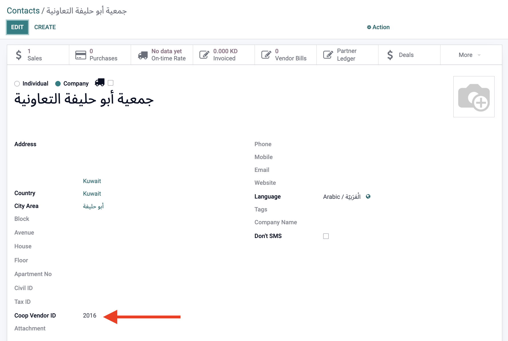

# Looome Base - Customizations

**Module**: `looome_base`  
**Type**: Custom (1)  
**Status**: ✅ In active use  

## Overview
The Looome Base module serves as the foundation module for the Looome brand customizations. It provides essential functionality for business operations including custom fields, product management, and specialized printing capabilities.

## Customizations Added

### 1. Custom Field: Coop ID for Partners
**Commit**: [f2c9c9fcae827ba431d6679ebca587a124b59def](https://github.com/YuehliaGeneral/odoo-15-docs/commit/f2c9c9fcae827ba431d6679ebca587a124b59def#diff-250d9278cdd6b6e2151f104fa8c4f52e8816cb5a2ad01f75c969ddc3afddd4d2R8)

- **Description**: Added custom field `coop_id` to partner model for use in printing operations
- **Impact**: Enables identification and tracking of cooperative partners in business operations
- **Use Case**: Essential for cooperative business model where partners need unique identification
- **Technical Details**: Custom field integration with partner model for print functionality

*Screenshot showing the custom coop_id field in partner records*

### 2. Product Customer Code Integration
**Commit**: [f2c9c9fcae827ba431d6679ebca587a124b59def](https://github.com/YuehliaGeneral/odoo-15-docs/commit/f2c9c9fcae827ba431d6679ebca587a124b59def#diff-6dd5056c1be87a32bd6b42fe35559699440054c1ea7aaac744b6aa2ca393d4c8R23)

- **Description**: Integrated product customer code functionality from `bi_product_customer_code` module
- **Impact**: Enables customer-specific product codes

### 3. UOM Ratio for Printing
**Commit**: [f2c9c9fcae827ba431d6679ebca587a124b59def](https://github.com/YuehliaGeneral/odoo-15-docs/commit/f2c9c9fcae827ba431d6679ebca587a124b59def#diff-769f87d812fc0e95f22725f089fb6fb2f58e8f5e071e6c433bf6f559adccd7ccR9)

- **Description**: Added `uom_ratio` field for use in printing operations
- **Impact**: Enables accurate unit of measure conversions in printed documents

### 4. Custom Layout Implementation
**Commit**: [f2c9c9fcae827ba431d6679ebca587a124b59def](https://github.com/YuehliaGeneral/odoo-15-docs/commit/f2c9c9fcae827ba431d6679ebca587a124b59def#diff-65af65a14bc0654164f5b5b030fab68b094b640080a5d9e7034a3f6267b379d5R3)

- **Description**: Implemented custom layout system for specialized printing requirements

### 5. Specialized Print Reports

#### 5.1 Looome Coop Print
**Commit**: [f2c9c9fcae827ba431d6679ebca587a124b59def](https://github.com/YuehliaGeneral/odoo-15-docs/commit/f2c9c9fcae827ba431d6679ebca587a124b59def#diff-d79b6f1ab99e2ce81daf2b0262eb74d9f69c5891b6de46a9c06a39d352578715R703)

- **Description**: Primary cooperative printing report with custom formatting
- **Purpose**: Standard cooperative business document printing
- **PDF Preview**: [Looome Coop Print.pdf](../documents/Looome%20Coop%20Print.pdf)
- **Technical Details**: Custom report template with cooperative-specific fields and layout

#### 5.2 Looome Coop Print 2
**Commit**: [f2c9c9fcae827ba431d6679ebca587a124b59def](https://github.com/YuehliaGeneral/odoo-15-docs/commit/f2c9c9fcae827ba431d6679ebca587a124b59def#diff-3f5ea41774b54f54362255bc9a21c4624e13377f9a290f7d910dfb7ca9bfdf90R256)

- **Description**: Secondary cooperative printing report variant
- **Purpose**: Alternative format for cooperative business documents
- **PDF Preview**: [Looome Coop Print 2.pdf](../documents/Looome%20Coop%20Print%202.pdf)
- **Technical Details**: Secondary report template with different formatting options

#### 5.3 Sale Order - B2B
**Commit**: [f2c9c9fcae827ba431d6679ebca587a124b59def](https://github.com/YuehliaGeneral/odoo-15-docs/commit/f2c9c9fcae827ba431d6679ebca587a124b59def#diff-167a74209b01db9437bbd00708479df0f809a446c8472caca536a943fcb9a1f3R259)

- **Description**: Business-to-business sale order printing report
- **Purpose**: Professional B2B transaction documentation
- **PDF Preview**: [Sale Order - B2B.pdf](../documents/Sale%20Order%20-%20B2B.pdf)
- **Technical Details**: B2B-focused report template with business-specific fields

## Dependecies
- `bi_product_customer_code` - Customer-specific product codes
- `sale_discount_total` - field used in the print
- Other Looome brand modules that extend this base functionality

## Business Benefits
- **Cooperative Support**: Specialized functionality (Prints) for cooperations requirements
