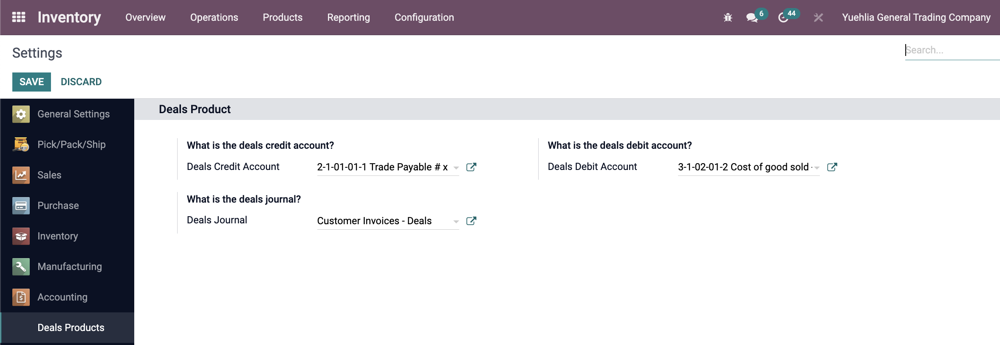
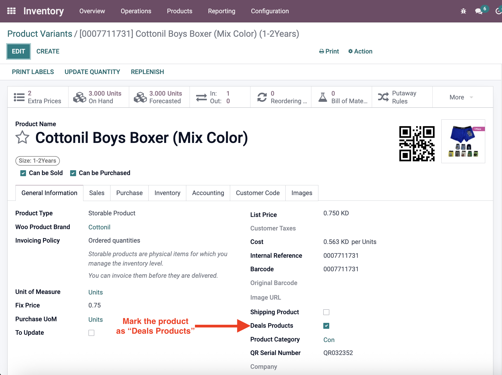
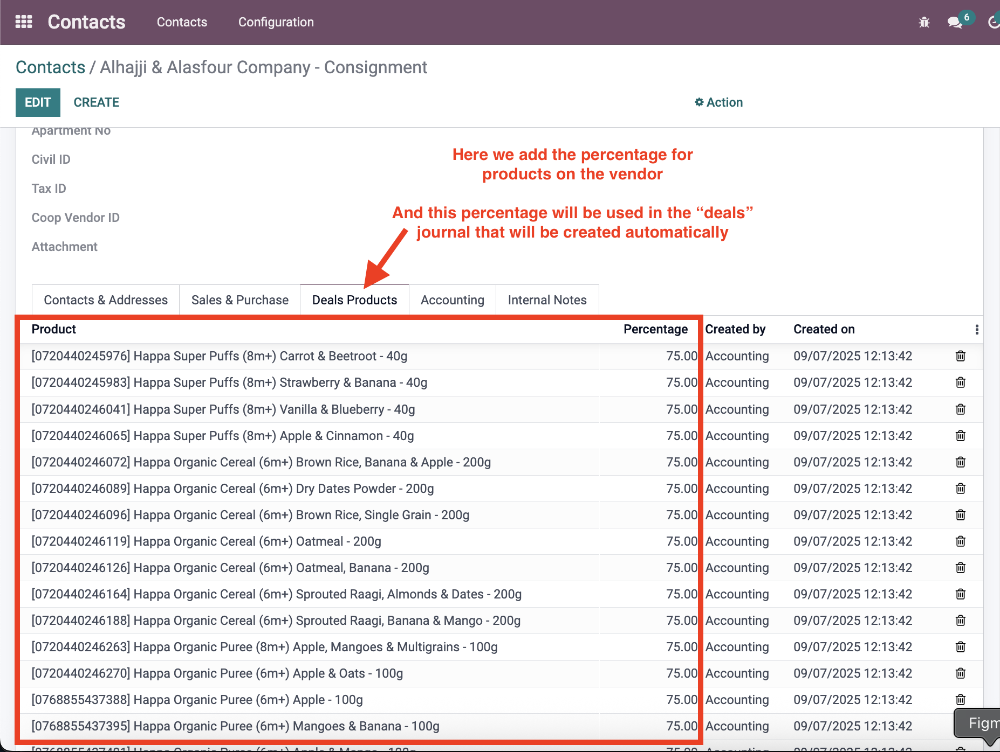
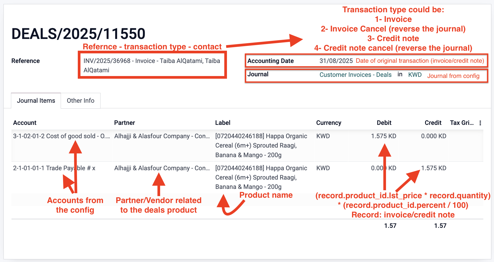

# Pharmaceuticals Products - Customizations

**Module**: `pharmaceuticals_products`  
**Type**: Custom (1)  
**Status**: ✅ In active use  

## Overview
The Pharmaceuticals Products module automatically creates journal entries for consignment products based on percentages set for each vendor. The module triggers when invoices/credit notes are validated or cancelled and contain consignment products, creating appropriate journal entries automatically.

**Note**: To eliminate confusion, the technical name "pharmaceuticals" or "deals" refers to "Consignment Product"

## Workflow Documentation

### Step 1: Configuration
In the configuration, we set the debit/credit accounts and the journal type for automatic journal creation.

*Screenshot showing the configuration settings for accounts and journal types*

### Step 2: Product Setup
In the product view for the consignment product, it must be marked as "Deals Products".

*Screenshot showing the product view with "Deals Products" checkbox*

### Step 3: Contact/Vendor Setup
In the contact, a section called "Deals Products" is added where the product is selected and the percentage is specified.

*Screenshot showing the contact view with deals products section and percentage settings*

### Step 4: Journal Creation
**Trigger**: When an invoice/credit note is validated or cancelled and contains deals products, journal entries are automatically created.

**Multiple Products**: If the invoice or credit note contains multiple deals products, multiple journals will be created accordingly.

*Screenshot showing the generated journal entry for consignment products*

## Journal Triggers (Also included in the journal entry ref field)

### 1. Invoice
- **Action**: Credits the payables account and debits the expense account
- **Trigger**: When invoice is validated

### 2. Invoice Cancel
- **Action**: Reverses the Invoice journal
- **Trigger**: When invoice is cancelled

### 3. Credit Note
- **Action**: Debits the payables account and credits the expense account
- **Trigger**: When credit note is validated

### 4. Credit Note Cancel
- **Action**: Reverses the credit note journal
- **Trigger**: When credit note is cancelled

## Purpose
The Pharmaceuticals Products module provides:
- **Automatic Journal Creation**: Eliminates manual journal entry creation for consignment products
- **Percentage-Based Calculations**: Uses vendor-specific percentages for accurate accounting
- **Invoice Integration**: Seamlessly integrates with invoice/credit note validation process
- **Consignment Management**: Handles complex consignment product accounting automatically

## Enhancement required
### 1. Smart Button Integration
- **Description**: Add a smart button to invoices/credit notes that links to generated journal entries
- **Purpose**: Provide easy access to view related consignment journal entries
- **Benefit**: Improves traceability and audit capabilities

## Technical Implementation
- **Automatic Triggers**: Invoice/credit note validation and cancellation events
- **Percentage Calculations**: Vendor-specific percentage application
- **Journal Entry Creation**: Automatic generation based on transaction type
- **Multi-Product Support**: Handles multiple consignment products in single transaction

## Audit Snapshot Fields
To improve traceability, when a deals product line triggers an automatic journal, the following fields are captured on each generated `account.move.line` at posting time:

- **pharm_quantity_snapshot**: Quantity from the originating invoice line at posting time
- **pharm_available_qty_snapshot**: Product free quantity at posting time
- **pharm_vendor_percent_snapshot**: Vendor percentage on product at posting time
- **pharm_product_price_snapshot**: Product list price at posting time
- **pharm_product_brand_snapshot**: Product brand value(s) at posting time
- **pharm_product_default_code_snapshot**: Internal reference at posting time
- **pharm_product_display_name_snapshot**: Product display name at posting time

These are read-only snapshots stored on the journal lines for audit purposes.

## Journal Reference Format
Generated vendor deals journal entries include a reference that indicates the source and action:

- **Invoice**: `INV-XXXX - Invoice - <Customer Name>`
- **Invoice Cancel**: `<Original Number> - Invoice Cancel - <Customer Name>`
- **Credit Note**: `RINV-XXXX - Credit Note - <Customer Name>`
- **Credit Note Cancel**: `<Original Number> - Credit Note Cancel - <Customer Name>`

The reference mirrors what is displayed in the "Journal Triggers" section and helps filtering and reconciliation.

## Technical Settings
The following system parameters determine the accounts and journal used for the generated entries:

- `pharmaceuticals_products.deals_debit_account_id`
- `pharmaceuticals_products.deals_credit_account_id`
- `pharmaceuticals_products.deals_journal_id`

Ensure these parameters are configured with valid IDs. The vendor on the product (`vendor_id`) is set as the partner on generated entries, and the brand list is stored as a comma-separated string when available.
