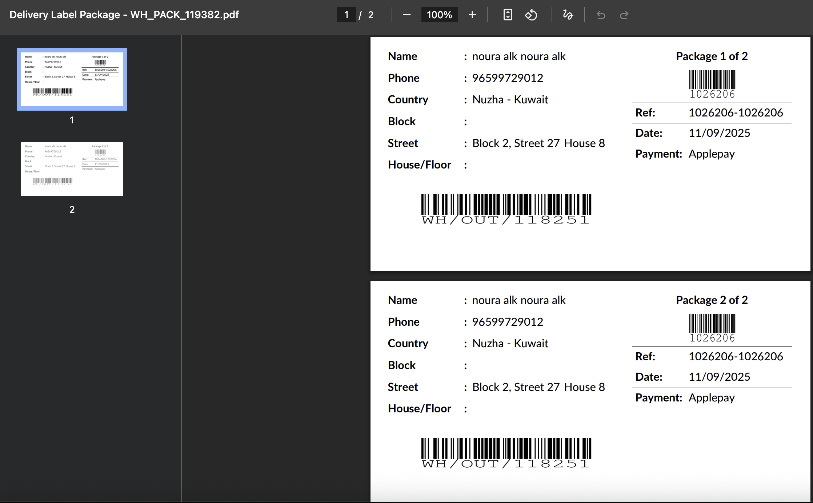
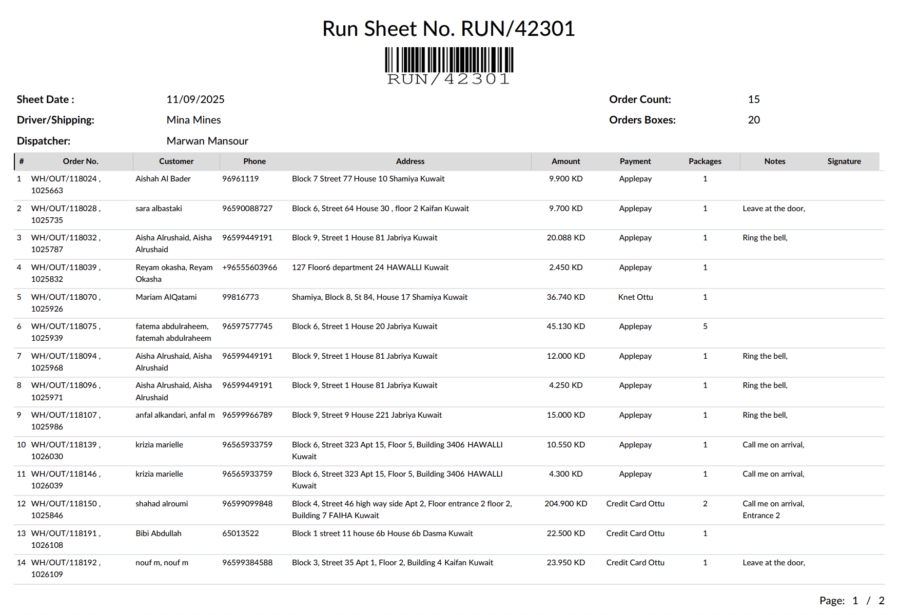
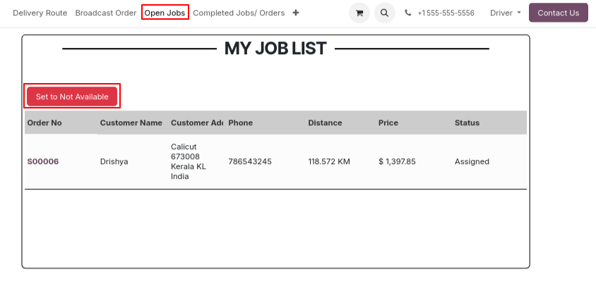

# Pick Pack Ship - Customizations

**Module**: `pick_pack_ship`  
**Type**: Custom (1)  
**Status**: ✅ In active use  

## Overview
The Pick Pack Ship module provides a comprehensive workflow for order fulfillment with three distinct stages: PICK, PACK, and OUT. It includes advanced features like bulk scanning, runsheet management, and delivery coordination for efficient warehouse operations.

## Workflow Documentation

### Pick Pack Ship (OUT) Flow

#### 1. PICK Stage
- **Picker Assignment**: Assign picker (employee marked as picker) using bulk scan feature
- **Bulk Scan Validation**: Validate multiple pickings at once
- **Permission Control**: Feature is limited to companies with hardcoded permissions based on picking type ID

#### 2. PACK Stage
- **Packer Assignment**: Assign packer (employee marked as packer) using bulk scan feature
- **Bulk Scan Validation**: Validate multiple pickings at once with company-specific permissions
- **Package Count**: Set packages count per picking
- **Delivery Label Print**: Print "delivery label by package" - if multiple packages, print contains two pages

*Screenshot showing the delivery label by package print format*

#### 3. OUT Stage
- **Driver Assignment**: Assign either external driver (Contact marked as driver) or internal driver (Employee marked as driver)
- **Runsheet Creation**: Create runsheet containing OUT pickings in one place
- **Runsheet Print**: Print runsheet for driver with delivery details including:
  - Customer phone number
  - Address
  - Payment method
  - Order details

*Screenshot showing the runsheet interface with delivery details*

#### 4. Runsheet Management
- **Dispatcher**: Person who created the runsheet
- **Stages**: 4-stage workflow
  1. **Draft**: Initial creation
  2. **Handover**: Ready for driver
  3. **Confirmed**: Driver confirmed
  4. **Done**: Completed - automatically validates pickings inside runsheet
- **Need to fix Issues**:
  - **Product Expiry Handling**
    - **Problem**: When OUT pickings contain products with lots showing expiry (expired or expiring soon), runsheet cannot validate
    - **Impact**: No proper error message displayed
    - **Status**: Needs resolution
  - **Multi-Company Issues**
    - **Employee Selection**: Employees can be selected across runsheets, causing authentication issues
    - **Sequence Generation**: Runsheet number sequence not generated properly for new companies, Only main company has the sequence
    - **Status**: Needs resolution

### Workflow Video
Complete workflow demonstration: [pick_pack_ship_runsheet.mp4](../screenshots/pick_pack_ship_runsheet.mp4)

## Modification Required to the Flow

### Current Process Limitation
Currently, the inventory users wait for the driver to confirm the delivery of all the orders in the runsheet, so that the user would validate the runsheet and therefore validate the orders all at once.

### Proposed Enhancement
What we want to be done is to make the drivers validate the orders by themselves, by having a portal user, with a section that shows ready and assigned orders to this driver, where he can validate directly from this portal.

### Additional Portal Features
Also, from the same portal, if the customer declines receiving the order, he would simply submit it to the portal and it will notify the inventory users so they can act and cancel order or contact the customer. This step can simply add a message/log note to the picking.

- Note that confirming the order delivery or rejecting the order should be done once the order is clicked from the main page

### Benefits
This will make the flow even more systematic, and we'll get proper KPIs for each driver.

### Screenshot Example (But columns to be same as runsheet):

## Code Distribution
- **Primary Module**: `pick_pack_ship`
- **Supporting Module**: `yuhelia_base`
- **Not Needed Dependencies**: 
  - `qr_code_product` (not needed/used - can be removed)

## Purpose
The Pick Pack Ship module provides:
- **Efficient Order Fulfillment**: Streamlined PICK → PACK → OUT workflow
- **Driver Coordination**: Runsheet system for delivery management
- **Bulk Operations**: Time-saving bulk scanning and validation
- **Print Integration**: Essential delivery documentation
- **Role Management**: Clear assignment of warehouse roles
