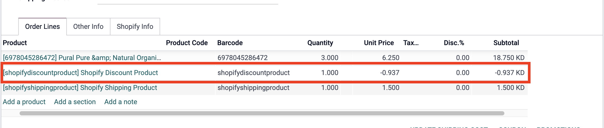

# Shopify Odoo Connector - Customizations

**Module**: `shopify_ept`  
**Type**: Paid + Customized  
**Status**: ✅ In active use  

## Overview
The Shopify Odoo Connector enables seamless integration between Shopify stores and Odoo ERP system. This module has been customized to enhance functionality and improve data synchronization workflows.

## Customizations Added

### 1. City Field Integration with Odoo Areas
**Commit**: [fb6d819235dae7c8ecf1f5a78719cc7e6c368423](https://github.com/YuehliaGeneral/odoo-15-docs/commit/fb6d819235dae7c8ecf1f5a78719cc7e6c368423)

- **Description**: Linked Shopify city field with the custom field `area_id` in Odoo
- **Technical Details**: Custom field mapping ensures city data from Shopify orders is properly categorized into Odoo area (custom field) system

### 2. Product Sync Inventory Management Default
**Commit**: [b220188b6bbd0086c305c7028f6cad102dec6db5](https://github.com/YuehliaGeneral/odoo-15-docs/commit/b220188b6bbd0086c305c7028f6cad102dec6db5)

- **Description**: Product sync value "inventory_management" now always defaults to "shopify", as the "inventory_management" due to a change in [shopify API](https://community.shopify.dev/t/replacement-for-variant-inventory-management-field/5180)
- **Reference**: https://shopify.dev/changelog/product-variant-field-cleanup
- **Technical Details**: Overrides default behavior to enforce "shopify" as the standard inventory management method

### 3. Stock Update on Picking Validation
**Commit**: [ff815f279239d2b3a97042a9ce93c43ac811b859](https://github.com/YuehliaGeneral/odoo-15-docs/commit/ff815f279239d2b3a97042a9ce93c43ac811b859)

- **Description**: Stock is automatically updated in Shopify upon picking validation, with added "Update Stock In Shopify" button in stock picking/scrap
- **Impact**: Real-time inventory synchronization between Odoo and Shopify
- **Use Case**: Ensures accurate stock levels across all sales channels
- **Technical Details**: 
  - Automatic stock update triggers when picking is validated
  - Manual update button available in stock picking and scrap operations
  - Maintains data consistency between Odoo inventory and Shopify store

*Screenshot showing the "Update Stock In Shopify" button in stock picking operations*

## Related Modules
- `common_connector_library` - Base connector library (also customized)

## Required enhancements

### 1. Line-level discounts on imported orders
- Currently, when importing an order with a discount applied to it, the discount comes as a separate line in Odoo.
- This causes reporting issues:
  - Product-grouped reports show gross amounts (without applied per-line discounts)
  - Margin-by-product reports are inaccurate because the discount is calculated separately from the product line

#### Suggested Fixes (Either one)
- Instead of using the discount product, to use the product that the discount is applied for
- Modify the unit price for the product so it would be discounted in the same line

