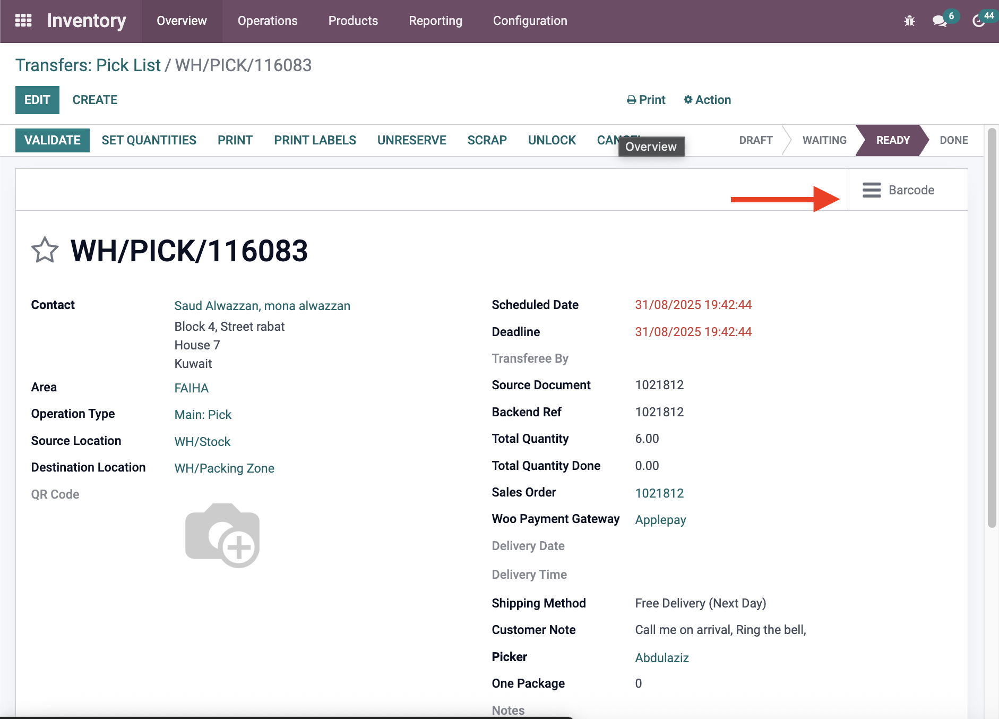

# Barcode in Sales/Purchase/Picking - Customizations

**Module**: `sis_barcode`  
**Type**: Custom (1)  
**Status**: ✅ In active use  

## Overview
The SIS Barcode module links the barcode module to the inventory transaction. Also it adds the column to different modules (sales, purchase, accounting)

## Customizations Added

### 1. Barcode Action in Stock Picking
- **Description**: Added barcode action button that opens the barcode module directly from stock picking transactions
- **Impact**: Provides quick access to barcode scanning functionality without navigating away from the picking
- **Use Case**: Streamlines barcode operations during warehouse picking processes
- **Technical Details**: Smart button integration with barcode scanning module

*Screenshot showing the barcode action button in stock picking interface*

### 2. Barcode Column Integration
- **Description**: Added barcode column display to multiple transaction line types
- **Affected Modules**:
  - **Sales Order Line**: Barcode information displayed in sales order line views
  - **Purchase Order Line**: Barcode information displayed in purchase order line views
  - **Account Move Line**: Barcode information displayed in account move line views

## Purpose
The SIS Barcode module provides:
- **Quick Access**: Direct barcode scanning from stock picking operations
- **Views**: Barcode display across sales, purchase, and accounting modules
- **Operational Efficiency**: Streamlined barcode operations in warehouse management

## Technical Implementation
- **Smart Button**: Direct integration with barcode module from stock picking
- **Field Addition**: Barcode column added to line views in multiple modules
