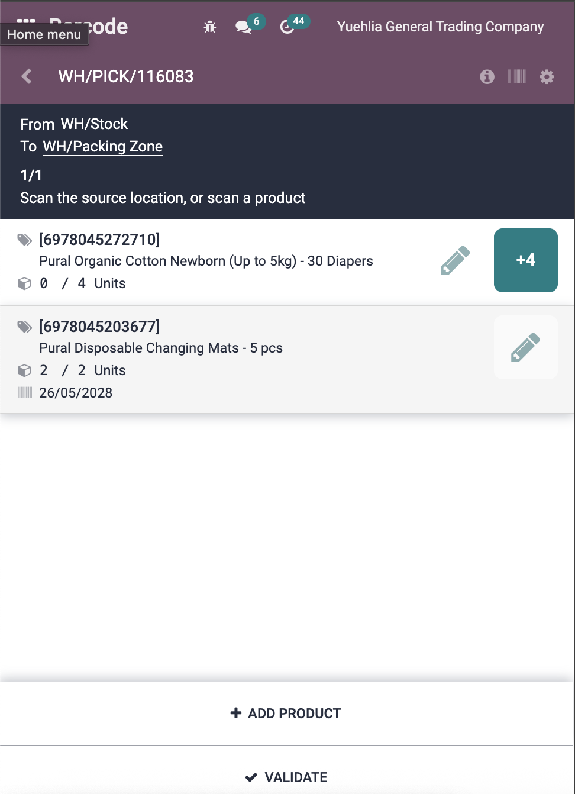
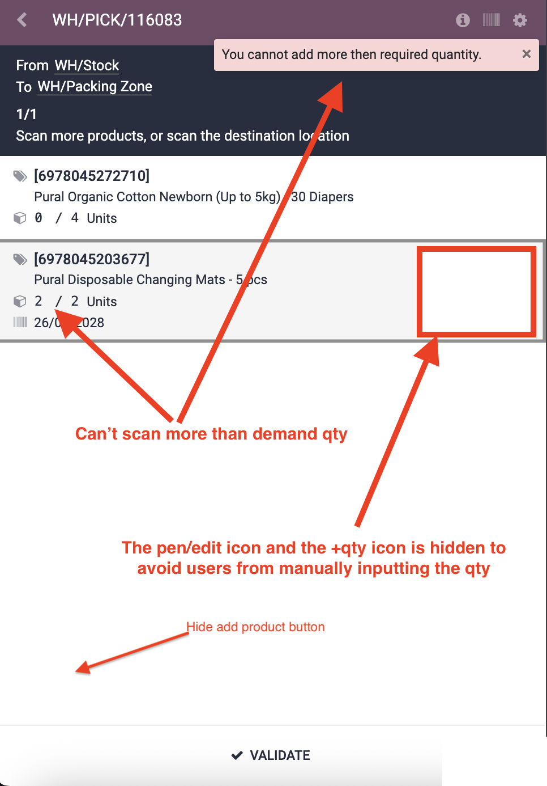
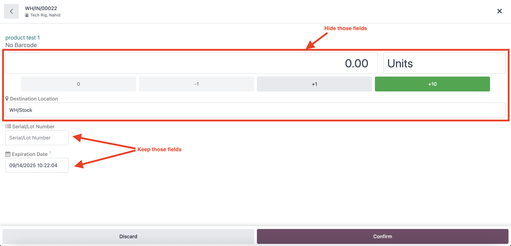

# Stock Barcode Screen – Restrict Over QTY/Line - Customizations

**Module**: `sis_barcode_screen_restrict`  
**Type**: Custom (1)  
**Status**: ✅ In active use  

## Overview
The Stock Barcode Screen Restrict module adds restrictions to the barcode scanning interface to prevent over-scanning and manual quantity input. It ensures employees can only scan up to the required quantity and removes manual input options to avoid human-error.

## Customizations Added

### 1. Quantity Restriction
- **Description**: Prevents scanning more than the demand quantity
- **Notification**: Shows "You cannot add more than required quantity." when limit is exceeded
- **Impact**: Ensures accurate inventory tracking and prevents over-scanning
- **Use Case**: Maintains data integrity in warehouse operations

### 2. Hide Edit Icon (Pen Icon)
- **Description**: Removes the pen/edit icon to prevent manual quantity input
- **Impact**: Forces employees to use barcode scanning instead of manual entry
- **Use Case**: Ensures all quantity changes are tracked through barcode scanning

### 3. Hide "Add Product" Button
- **Description**: Removes the "Add Product" button from the interface
- **Impact**: Prevents manual product addition what so even to keep the inventory transactions consistent with the source document (sales/purchase)

## Visual Comparison

### Before Restriction

*Screenshot showing the barcode interface before restrictions were applied*

### After Restriction

*Screenshot showing the barcode interface after restrictions were applied - edit icon and add product button are hidden*

## Purpose
The Stock Barcode Screen Restrict module provides:
- **Quantity Control**: Prevents over-scanning beyond demand requirements
- **Process Enforcement**: Forces barcode-based operations only
- **Data Integrity**: Eliminates manual input that could cause errors
- **Workflow Compliance**: Ensures employees follow proper scanning procedures

## Needed Enhancement

### Purchase Receipts Issue
At the moment this solution is working fine with all transaction types except the purchase receipts, and that's because the recipient must add the lot/expiry, and since the edit page is hidden, it must be done from the form view, which could compromise the inventory if the product wasn't scanned.

### In newer Odoo versions
What we have noticed is that in newer Odoo version 18/19 the edit page now contains a field for the expiry data to be added, while Odoo 15 didn't.

*Screenshot showing the Odoo 18/19 barcode edit interface with expiry field*

### Proposed Solution
We would like to keep the pen/edit icon but also with restrictions, the restriction is not to change the warehouse or the quantities manually, but to be able to input the lot/expiry.

## Technical Implementation
- **Quantity Validation**: JavaScript validation to check against demand quantity
- **UI Element Hiding**: CSS/JavaScript to hide edit icons and add product button
- **Notification System**: User-friendly error messages for restriction violations