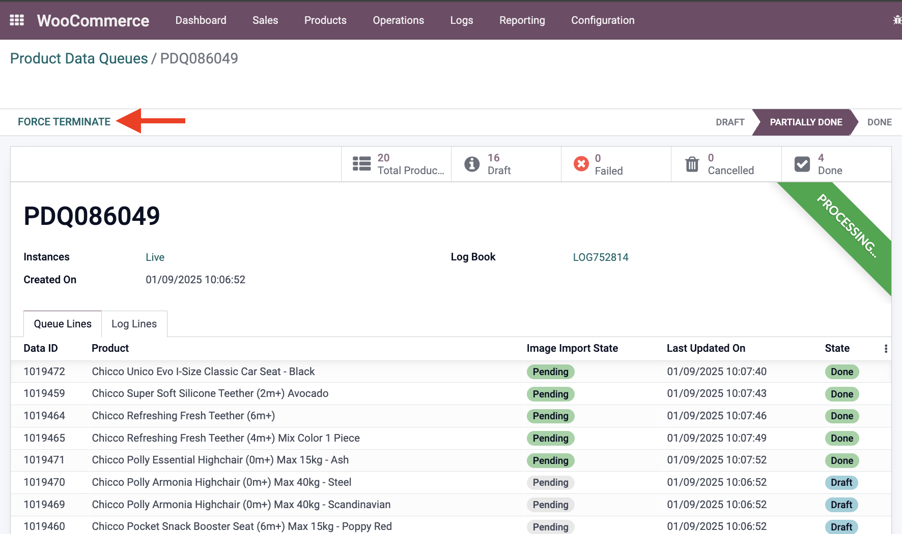
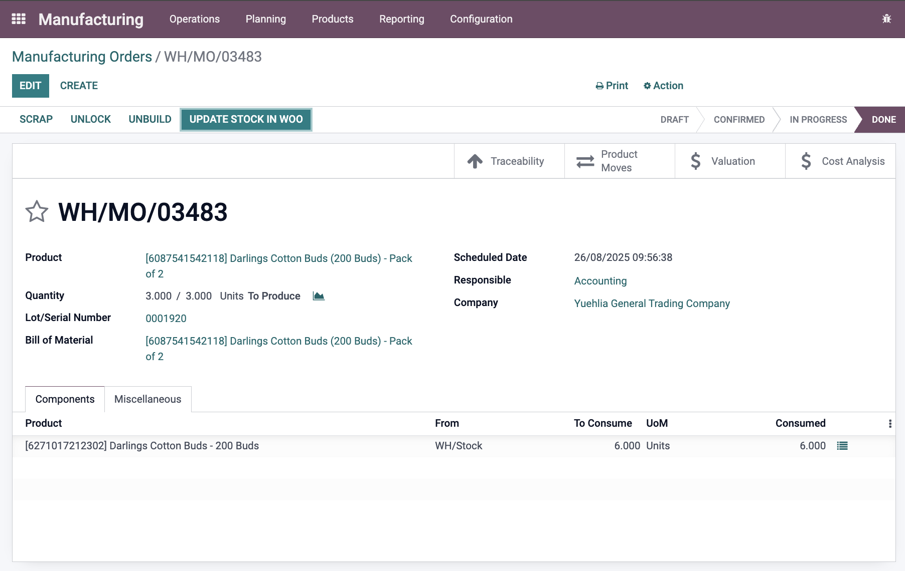
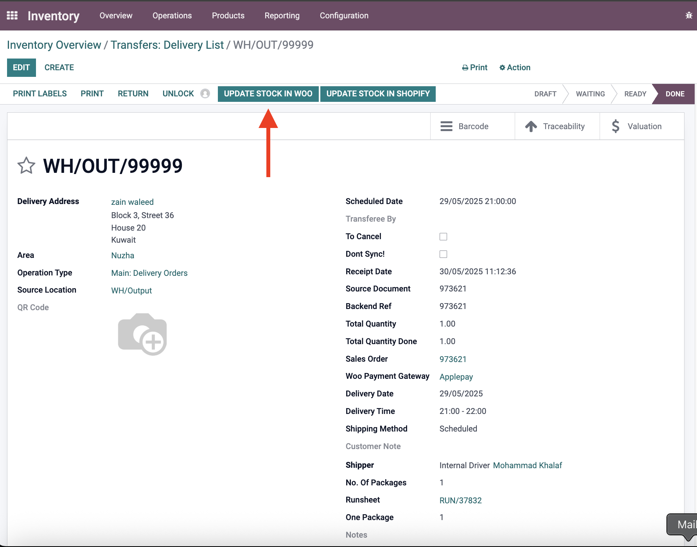
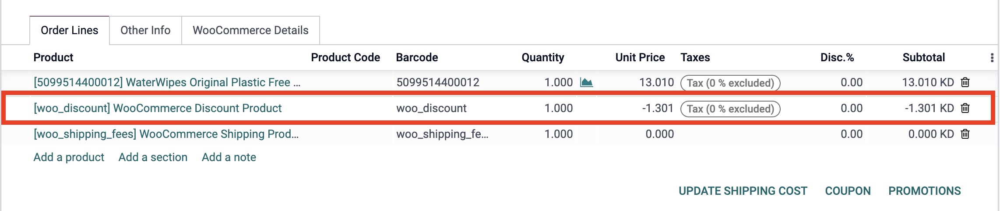

# WooCommerce Odoo Connector - Customizations

**Module**: `woo_commerce_ept`  
**Type**: Paid + Customized  
**Status**: ✅ In active use  

## Overview
The WooCommerce Odoo Connector enables seamless integration between WooCommerce stores and Odoo ERP system. This module has been extensively customized to enhance functionality, improve data synchronization workflows, and address specific business requirements.

## Customizations Added

### 1. Force Terminate Button for Product Queue
**Commit**: [1f8e91268784f180a361510f4a51ea4adb3738b9](https://github.com/YuehliaGeneral/odoo-15-docs/commit/1f8e91268784f180a361510f4a51ea4adb3738b9)

- **Description**: Added "Force Terminate" button to product data queue for immediate queue termination
- **Impact**: Allows users to forcefully stop stuck or problematic queue processing
- **Technical Details**: 
  - Added `is_terminated` boolean field to track termination status
  - New `action_force_terminate()` method stops processing and cancels remaining items
  - UI button only visible when queue is processing and not already terminated
- **Use Case**: Resolves stuck queues that consume system resources unnecessarily

*Screenshot showing the "Force Terminate" button in the product data queue interface*

### 2. Automatic Sync Upon Refund
**Commit**: [f99026da216629b04a15f26dd31a95436fb4a8fe](https://github.com/YuehliaGeneral/odoo-15-docs/commit/f99026da216629b04a15f26dd31a95436fb4a8fe)

- **Description**: Automatically syncs data when refunds are processed
- **Impact**: Ensures refund information is immediately reflected in WooCommerce
- **Use Case**: Maintains real-time synchronization of financial transactions

### 3. Sync Quantity on MRP (Manufacturing Resource Planning)
**Commit**: [20af7ff72c5b66e96d6e25dbce83c991b065ccad](https://github.com/YuehliaGeneral/odoo-15-docs/commit/20af7ff72c5b66e96d6e25dbce83c991b065ccad)

- **Description**: Synchronizes product quantities with MRP system
- **Impact**: Ensures accurate stock levels across manufacturing and sales channels
- **Use Case**: Maintains consistency between production planning and e-commerce inventory

*Screenshot showing MRP stock synchronization functionality with WooCommerce*

### 4. Comprehensive Product and Stock Management Enhancements
**Commit**: [3aec7dd09dbe6353dfee08d938f4cf4ac0da806c](https://github.com/YuehliaGeneral/odoo-15-docs/commit/3aec7dd09dbe6353dfee08d938f4cf4ac0da806c)

#### 4.1 Service Product Handling
- **Skip stock update for service products**: Prevents unnecessary stock synchronization for non-physical products
- **Support for custom WooCommerce product types**: Added support for `wgm_gift_card` and other custom types treated as Odoo service products

#### 4.2 Product Brands Compatibility
- **Brand synchronization**: Added `sync_woo_brands_with_product_v1_v2_v3` function (similar to categories)
- **Customized template preparation**: Modified `prepare_woo_template_vals` to include brands
- **Arabic brand filtering**: Special logic to detect and handle Arabic brand names
- **Template title updates**: Attempts to update product template titles for English products (line 2270)

#### 4.3 Stock Management Improvements
- **Reverted stock update functions**: Rolled back to older, more stable versions of `update_stock` and `woo_update_stock` functions
- **New stock update function**: Added `update_stock_for_products` for enhanced stock management
- **Manual stock sync button**: Added "Update in woo" button to stock picking for manual stock synchronization
- **Product SKU enhancement**: WooCommerce SKU now imported as both internal reference and barcode in Odoo

*Screenshot showing the "Update in woo" button in stock picking for manual stock synchronization*

#### 4.4 Partner and Order Enhancements
- **Area integration**: Added area field under partner profile for geographic categorization
- **Custom delivery fields**: Integrated WooCommerce custom fields:
  - `delivery_date`: Custom delivery date field
  - `delivery_time`: Delivery time preferences
  - `shipping_method`: Shipping method selection
- **Scheduled date logic**: Delivery date and time fields affect the scheduled_date field

*Screenshot showing the custom delivery fields: delivery date, delivery time, scheduled date, and shipping method*

#### 4.5 Product Sync Control
- **Dont_sync field**: Added `dont_sync` field to products to prevent synchronization for problematic items
- **Workaround solution**: Provides control over which products should be excluded from sync operations

## Purpose
These customizations enhance the WooCommerce connector's functionality by:
- Improving queue management and error handling
- Enhancing product and inventory synchronization
- Adding support for custom product types and brands
- Providing better control over synchronization processes
- Ensuring data consistency across platforms

## Related Modules
- `common_connector_library` - Base connector library (also customized)
- `shopify_ept` - Shopify connector (also customized)

## Business Benefits
- **Operational Efficiency**: Better queue management and automatic synchronization reduce manual work
- **Data Accuracy**: Enhanced stock and product synchronization ensures consistent information
- **Flexibility**: Support for custom product types and selective sync provides operational flexibility
- **Error Prevention**: Improved error handling and rollback mechanisms prevent data inconsistencies
- **Geographic Support**: Area integration and Arabic brand handling support regional business needs

## Required enhancements

### 1. Line-level discounts on imported orders
- Currently, when importing an order with a discount applied to it, the discount comes as a separate line in Odoo.
- This causes reporting issues:
  - Product-grouped reports show gross amounts (without applied per-line discounts)
  - Margin-by-product reports are inaccurate because the discount is calculated separately from the product line

#### Suggested Fixes (Either one)
- Instead of using the discount product, to use the product that the discount is applied for
- Modify the unit price for the product so it would be discounted in the same line

