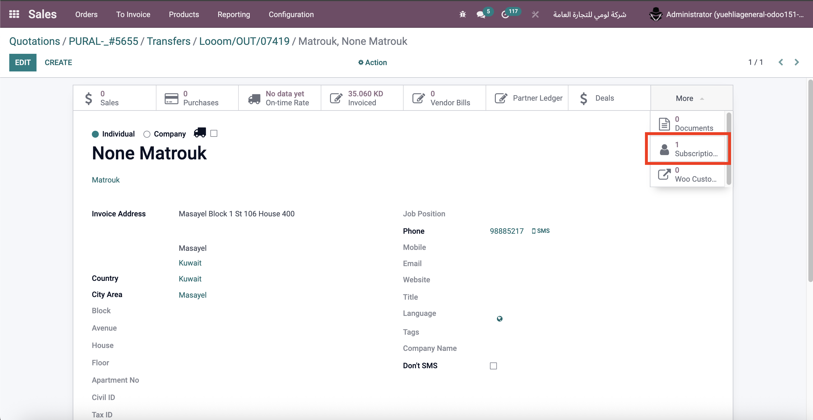
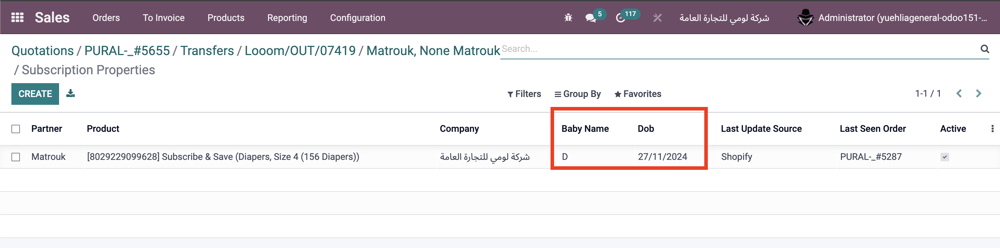
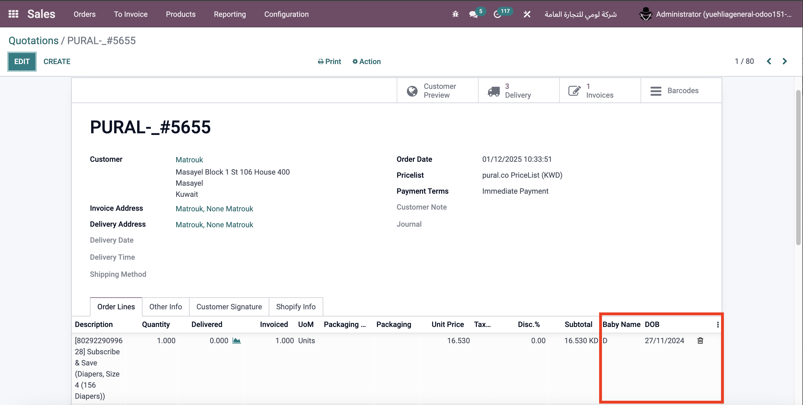
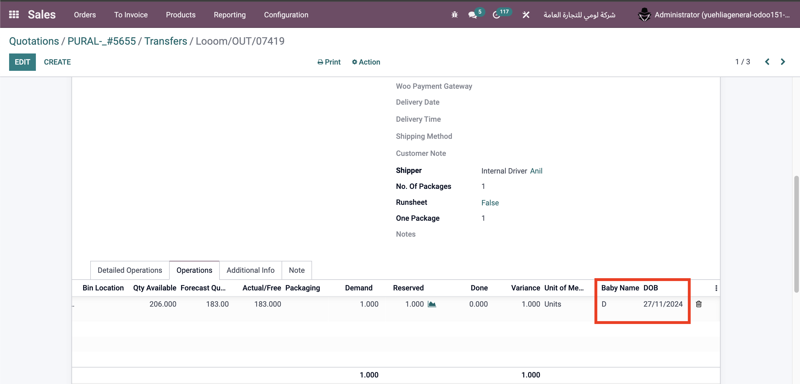

# Shopify Subscription Properties - Customizations

**Module**: `yue_shopify_subscription_properties`  
**Type**: Custom (1)  
**Status**: ✅ In active use

## Overview

This module captures Shopify subscription line properties (Baby Name, DOB) per customer/product/company and reuses them on future imports. It ensures idempotent storage and consistent propagation of these values across sales and inventory flows.

## Behavior

- On Shopify order import, the module overrides `sale.order.create_shopify_order_lines` to:
  - Parse `line.properties` for subscription fields (Baby Name, DOB)
  - Normalize and validate date-of-birth values
  - Detect subscription-tagged variants using `shopify.product.product.ept`
  - Create or update a single `yue_shopify_subscription.property` record scoped by customer, product, and company
  - Skip record creation when both values are empty
- On subsequent imports for the same customer/product/company, previously stored values are reused to avoid duplicates and keep data consistent

## UI Changes

- Partner form: Smart button to view stored subscription properties
- Product form: Smart button to view stored subscription properties
- Sale Order lines: Read-only Baby Name / DOB displayed
- Stock moves & pickings: Baby Name / DOB displayed consistently
- Labels: Baby Name – DOB summary printed on relevant labels

Screenshot showing the smart button on the partner form to access subscription properties

Screenshot showing the detailed view of subscription properties from the partner smart button

Screenshot showing read-only Baby Name and DOB displayed on sale order lines

Screenshot showing Baby Name and DOB on stock picking/moves

## Security & Access

- Sales Users: Read-only access to subscription properties
- Sales Managers: Edit permissions
- Record rules: Restrict visibility to the user's companies

## Technical Notes

- Method override: `sale.order.create_shopify_order_lines`
- Subscription detection: via `shopify.product.product.ept` on variants
- Data model: `yue_shopify_subscription.property` stores Baby Name & DOB per (partner, product, company)
- Idempotency: Update existing record when present; do not create when values are empty
- Data propagation: Values surface on sale order line, stock moves/pickings, and label prints

## Purpose

- **Customer experience**: Preserve subscription personalization without manual re-entry
- **Operational consistency**: Ensure the same Baby Name/DOB flow through sales and logistics
- **Prevent duplicates**: Prevent duplicate records and enforce normalized DOB values
