# Yuehlia Base - Customizations

**Module**: `yuhelia_base`  
**Type**: Custom (1)  
**Status**: ✅ In active use  

## Overview
The Yuehlia Base module serves as the core foundation module for Yuehlia brand customizations. It provides essential functionality that integrates and enhances multiple business processes including inventory management, sales, purchases, and e-commerce operations.

## Dependencies
- `pick_pack_ship` - Custom workflow for picking, packing, and shipping
- `woo_commerce_ept` - WooCommerce connector
- `purchase_discount` - Purchase order discounts
- `common_connector_library` - Base connector library
- `purchase_bonus_qty` - Purchase bonus quantity functionality

## Customizations Added

### 1. Stock Picking Enhancements

#### 1.1 Delivery Information Fields
- **delivery_date**: Custom delivery date field
- **delivery_time**: Delivery time preferences
- **shipping_method**: Shipping method selection
- **customer_note**: Customer-specific notes
- **payment_gateway_id**: Related payment gateway from sale order

Note: See the screenshot added in section 1.3 for how these delivery date/time fields display on pickings; the same columns are also added to the sale orders list view.

#### 1.2 Package Management
- **pkg_one**: Single package count field
- **no_of_boxes**: Computed field for total package count
- **runsheet_state**: Related runsheet state (draft, handover, confirmed, done, cancelled)

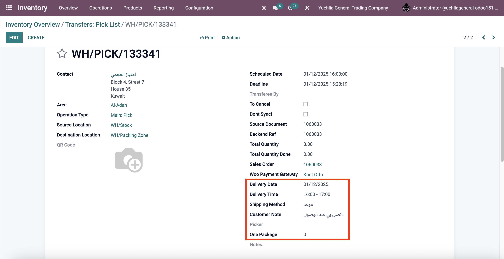

Screenshot for the Picking operation of type "PICK" showing relevant fields.

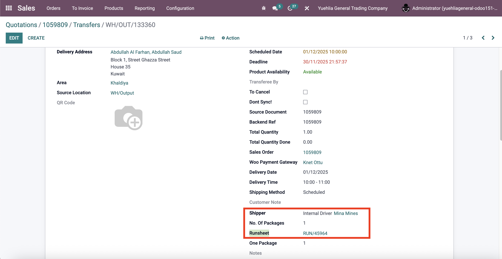

Screenshot for the Picking operation of type "OUT" showing relevant fields.

#### 1.3 Scheduled Date Logic
- **Automatic scheduling**: Delivery date and time affect the scheduled_date field
- **Timezone handling**: Converts local time to UTC for proper scheduling
- **Move line updates**: Updates stock move lines with new scheduled dates

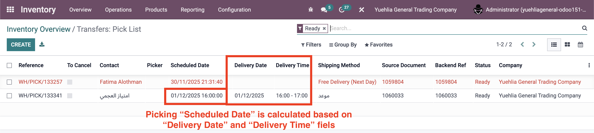

Note: The same delivery date/time columns are also added to the Sale Orders list view.

### 2. Product Management Enhancements

#### 2.1 Product Template Extensions
- **product_code**: Related vendor product code from seller information
- **product_name**: Related vendor product name from seller information
- **woo_product_template_ids**: One2many relationship with WooCommerce products
- **product_brand_ids**: Many2one relationship with product brands
- **product_categ_ids**: Related WooCommerce categories

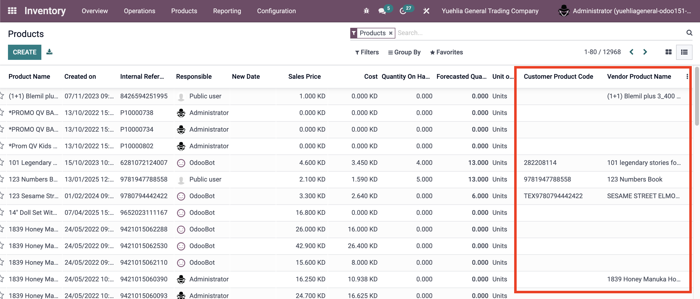

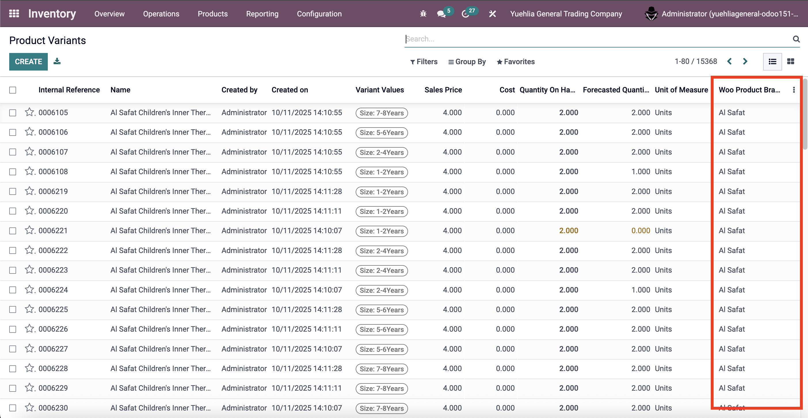

Note: Brand field is synced from WooCommerce. Only English products should sync this field. There is an issue where not all products in Odoo show a brand value even though WooCommerce has it for all; this should be fixed.

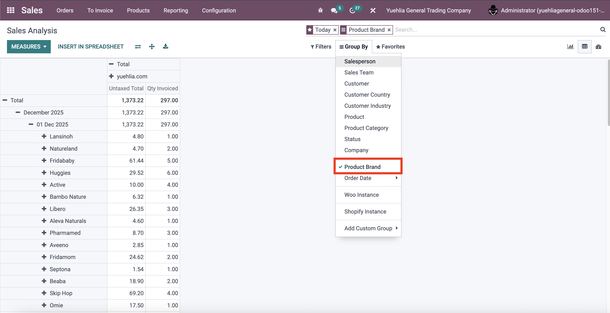

Note: Brand value is available to group sales reports by brand.

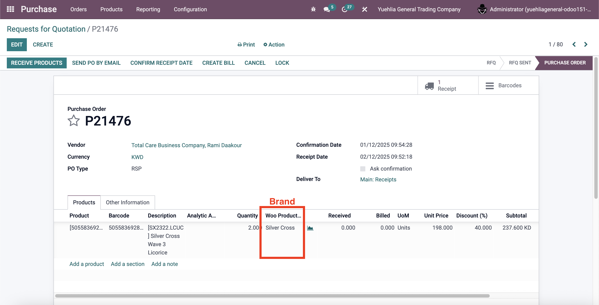

Note: Brand value is added to the Purchase form as well.

#### 2.2 Product Search Enhancement
- **Enhanced search**: Includes product name, default code, barcode, and vendor product name in search
- **Multi-field search**: Searches across multiple product identification fields

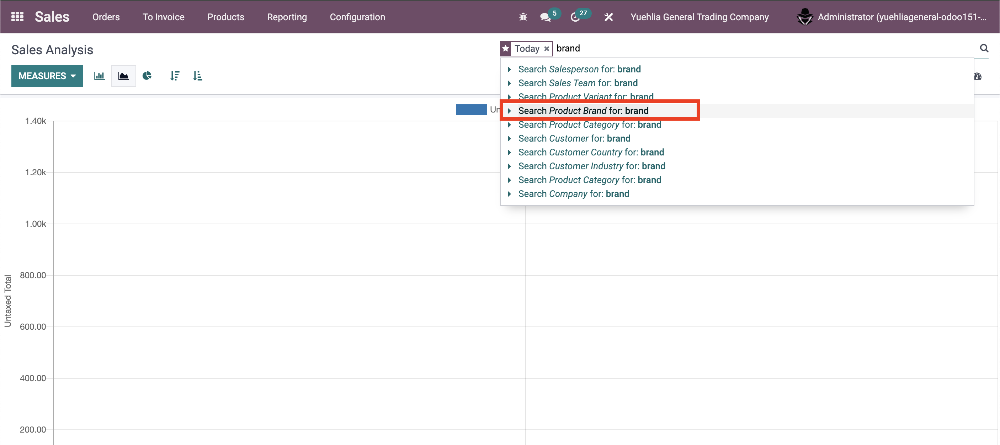

Note: Brand value is searchable.

### 3. Purchase Order Enhancements

#### 3.1 Purchase Order Line Extensions
- **total_qty**: Computed field showing total quantity (qty + bonus qty)
- **product_brand_ids**: Related product brand information
- **Price automation**: Automatically sets price unit to product standard price: yuhelia_base/models/purchase.py:16-21, if the price is 0 then use the product_id.standard_price

Note: Brand value is added to the Purchase form.

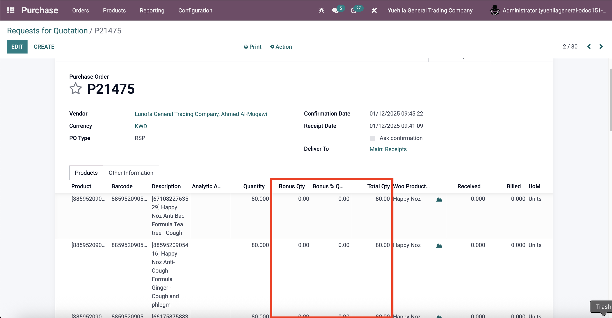

Note: The total qty field was created because we have a bonus qty (FOC) customization from the `purchase_bonus_qty` module.

#### 3.2 Purchase Order Extensions
- **po_type**: Selection field for PO Type (WSP, RSP)
- **amount_discount**: Computed field for total discount amount

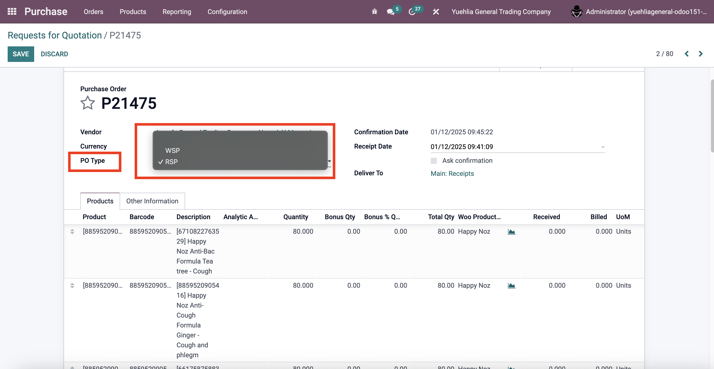

Note: This is a simple drop-down to indicate which pricing type the PO is using; no further logic depends on it.

### 4. Sale Order Enhancements

#### 4.1 Partial Credit Note Functionality
- **partial_credit_note()**: Method to open WooCommerce return order wizard
- **WooCommerce integration**: Seamless integration with WooCommerce cancellation process

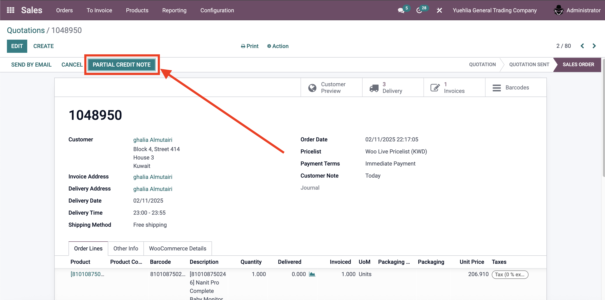

Note: Create credit note button shortcut – Not used; can be removed.

#### 4.2 Customer Notes
- **customer_note**: Field for customer-specific notes in sale orders

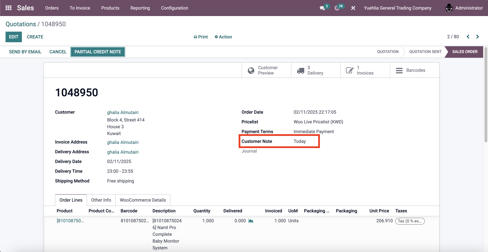

### 5. WooCommerce Integration

#### 5.1 Stock Update Automation
- **auto_update_all_prod_stock()**: Method to update all product stock to WooCommerce - Can be removed as its note used (function: auto_update_all_prod_stock, cron: ir_cron_update_woo_stock_all)
- **Cron job**: Automated daily stock update (currently disabled)
- **Instance-based updates**: Updates stock for specific WooCommerce instances

### 6. Runsheet Enhancements

#### 6.1 Internal Driver Support
- **emp_driver_id**: Many2one field for internal driver assignment - Its already defined in pick_pack_ship module, not sure if needed in yuehlia_base. (reference: yuhelia_base/models/runsheet.py)

### 7. Stock Move Line Enhancements

#### 7.1 Automatic Lot Generation
- **lot_name**: Auto-generated lot/serial numbers using sequence, not needed and can be removed (reference: yuhelia_base/models/stock.py:80-83)
- **pro_image**: Related product image for visual identification

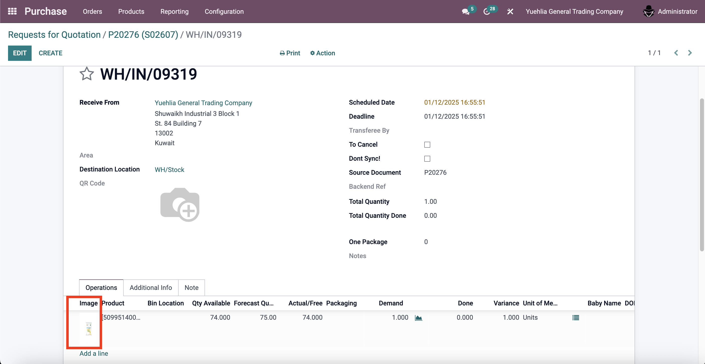

#### 7.2 Stock Move Extensions
- **vendor_product_code**: Related vendor product reference number - can be removed as "report_vendor_receipt_document"(pick_pack_ship/report/delivery_receipt_temp.xml) report from pick_pack_ship module is not used (Reference: yuhelia_base/models/stock.py:90)
- **vendor_product_name**: Related vendor product name - can be removed as "report_vendor_receipt_document"(pick_pack_ship/report/delivery_receipt_temp.xml) report from pick_pack_ship module is not used (Reference: yuhelia_base/models/stock.py:91)
- **pro_image**: Related product image

### 8. View Customizations

#### 8.1 Product Views
- **Search enhancement**: Added product code and name to search fields
- **Tree view**: Added product code and name columns
- **Purchase tab**: Restricted access to specific user groups

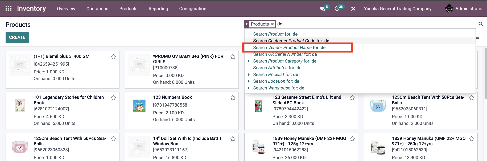

Note: Vendor product code and name are included in the search to help the purchasing department find products faster.

#### 8.2 Purchase Views
- **Order line enhancements**: Added total quantity and product brand columns
- **PO type field**: Added purchase order type selection
- **Report customization**: Added barcode to purchase order reports

Note: Brand value is added to the Purchase form.

Note: The total qty field was created because of the bonus qty (FOC) customization from the `purchase_bonus_qty` module.

Note: This is a simple drop-down to indicate which pricing type the PO is using; no further logic depends on it.

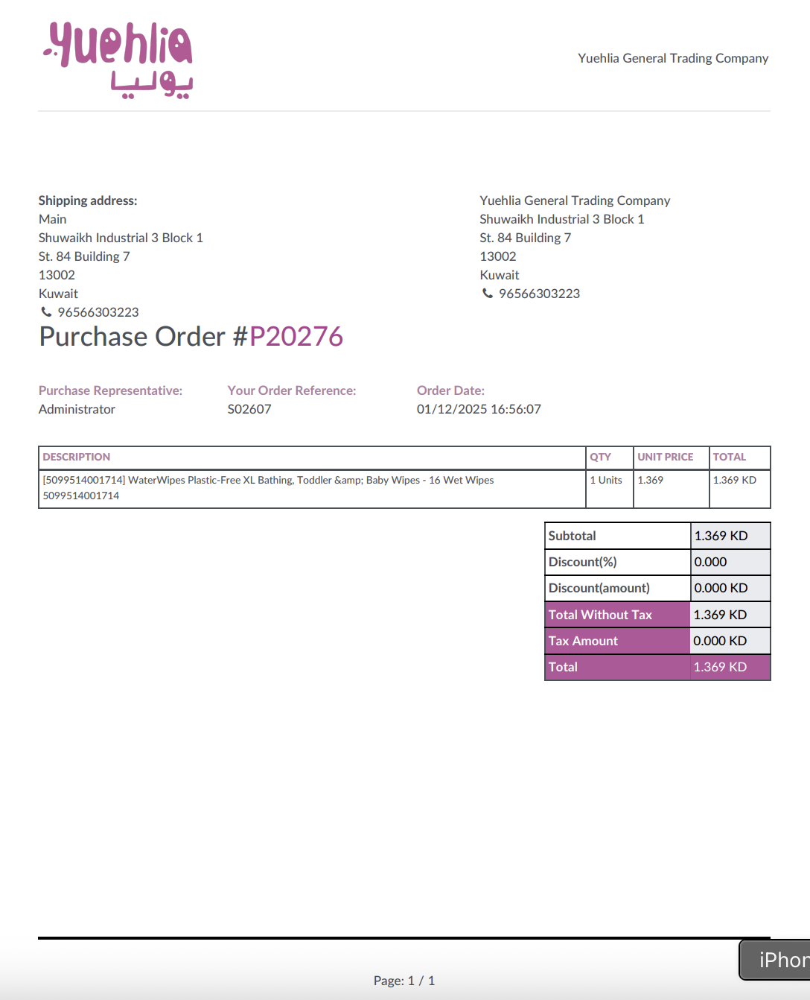

Note: The print layout differs when a PO contains bonus qty values.

#### 8.3 Stock Views
- **Product image**: Added product image widget in picking operations
- **Delivery information**: Added delivery date, time, and shipping method fields
- **Package management**: Simplified package count interface (only pkg_one visible)
- **Vendor information**: Added vendor product code and name in move lines

#### 8.4 Sale Views
- **Customer notes**: Added customer note field
- **Partial credit note**: Added button for WooCommerce partial credit note process

### 9. Security and Access Control

#### 9.1 User Groups
- **group_contacts_show**: Controls visibility of contacts menu
- **group_product_template_show**: Controls access to product purchase tab

### 10. Data and Sequences

#### 10.1 Sequence Generation
- **stock.move.line**: Auto-generated sequence for lot/serial numbers

#### 10.2 Cron Jobs
- **WooCommerce stock update**: Automated daily stock synchronization (disabled by default)

## Purpose
The Yuehlia Base module provides:
- **Core Integration**: Seamless integration between multiple business modules
- **Enhanced Workflows**: Improved picking, packing, and shipping processes
- **E-commerce Support**: Enhanced WooCommerce integration and automation
- **Data Consistency**: Unified product and vendor information across modules
- **User Experience**: Improved interfaces and user controls

## Business Benefits
- **Operational Efficiency**: Streamlined workflows across all business processes
- **Data Integration**: Consistent product and vendor information
- **E-commerce Automation**: Automated stock updates and order processing
- **User Control**: Enhanced access control and user experience
- **Process Standardization**: Unified processes across different modules

## Technical Implementation
- **Model Inheritance**: Extends multiple Odoo models with custom fields and methods
- **View Customization**: Modifies existing views to add new functionality
- **Security Integration**: Implements user group-based access control
- **Cron Automation**: Automated processes for stock synchronization
- **Sequence Management**: Auto-generation of lot/serial numbers
